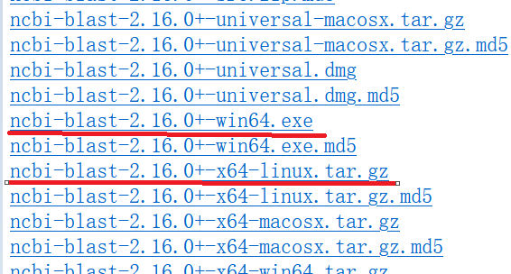
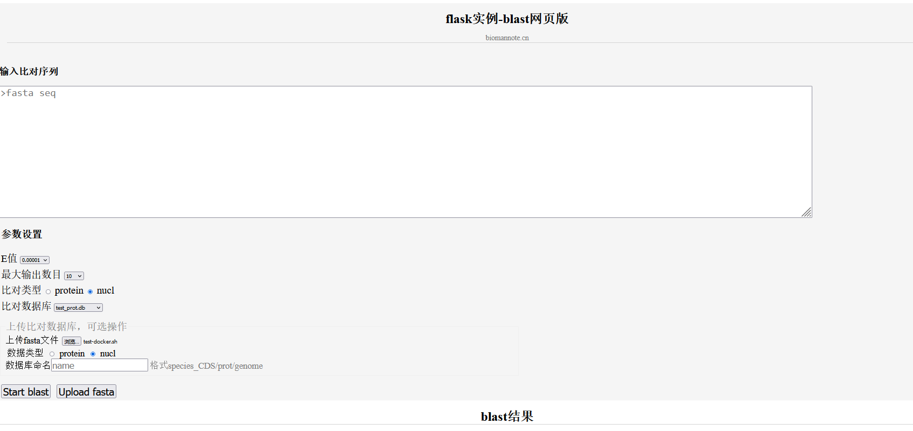

# blast本地网页版

# 1. 介绍

使用flask和blast开发了一款基于浏览器UI的序列比对工具flask_blast。

开发环境

- python=3.6.8
- flask=1.1.1
- jquery=3.7.0

功能：可视化操作blast蛋白和DNA比对，建立本地数据库。

# 2. 安装

## 2.1 安装blast

首先去NCBI下载并安装blast软件。网址：https://ftp.ncbi.nlm.nih.gov/blast/executables/blast+/LATEST/



如上，如果你是windos用户，点击第一条红线对应的版本，win64.exe下载安装。如果你是linux用户，点击第二个版本安装，x64-linux.tat.gz。

## 2.2 安装python

如果你的电脑上已经安装了python可以跳过该步骤。

可以使用conda安装，安装完成后使用`pip install flask`安装flask模块。

# 3. 运行

运行前确保5000端口没有被占用，使用如下代码运行

```bash
python app.py
```

进去浏览器在地址栏输入：http://127.0.0.1:5000/static/html/blast.html

# 4. 使用示例




操作说明：

1. 建立数据库：上传比对的数据库fasta文件，注明是蛋白(protein)还是核酸(nucl)数据，并给数据库命名。命名格式，“物种名_数据库类型”，数据库类型可以自定义，一般为CDS/genome/prot 。点击`upload fasta`上传数据，开始建立数据库，数据库建立完成后会有弹窗提示
2. 输入比对数据：在输入比对数据栏下输入fasta格式的序列
3. 设置比对参数：E值一般设置为0.00001；最大输出数量默认为10；比对类型设置成蛋白或核算；比对的数据库选择你刚刚上传的数据库名；点击`start blast`开始比对
4. 在blast栏下查看比对结果，点击可显示具体的必对情况

# 5. 演示

演示视频
